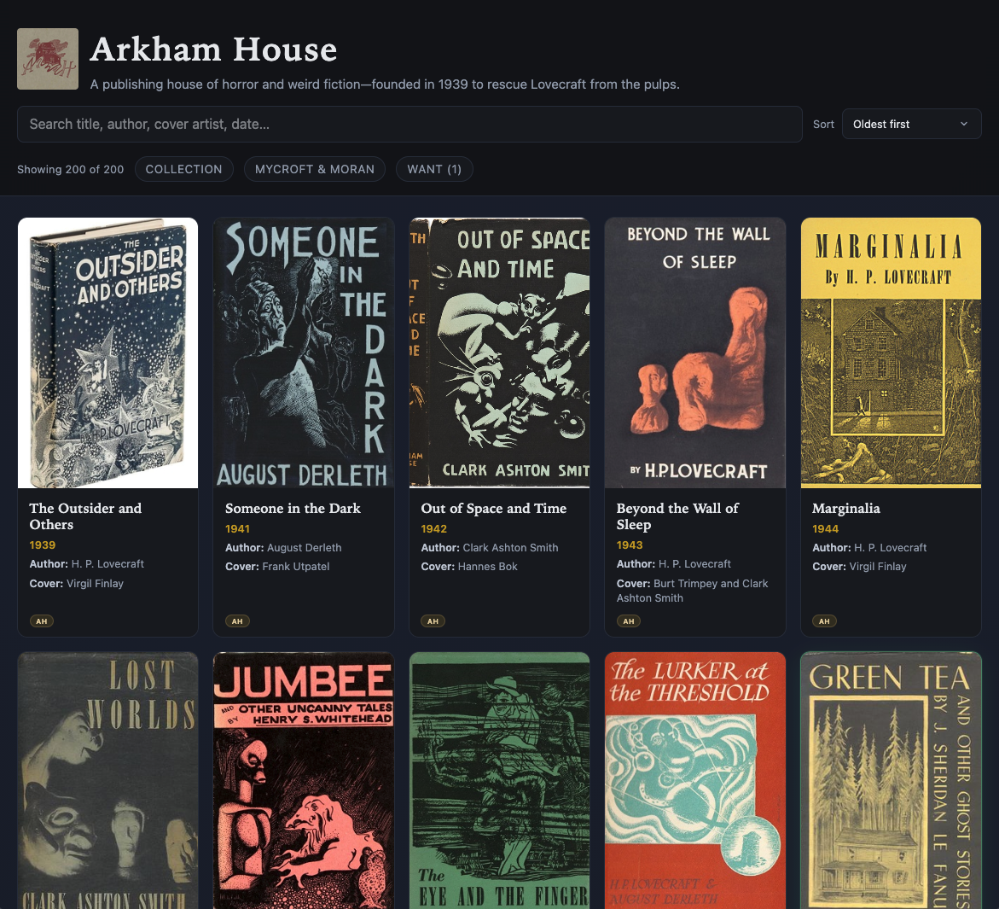
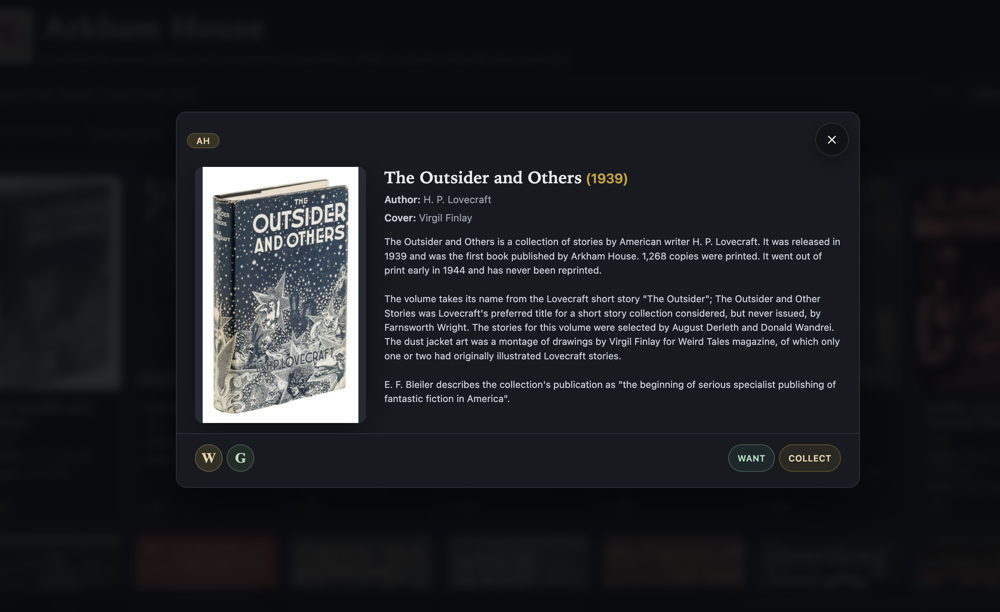

# Arkham House bibliography gallery

**[arkhamcollector.org](https://arkhamcollector.org)** — browse ~200 Arkham House and Mycroft & Moran editions with covers, search, and collector tools. No account; your list stays in the browser.

> Built with AI assistance, guided through hundreds of prompts—not generated in one shot.

## What the site is for

A visual catalog for collectors and readers of [Arkham House](https://en.wikipedia.org/wiki/Arkham_House) weird fiction: every bibliography line from Wikipedia, cover art where available, publication metadata, and links out to Wikipedia and Goodreads. Use it to **browse the imprint**, **mark what you own**, **track a want list**, and **filter** down to gaps in your shelves.

| | |
|---|---|
| **Search & sort** | Search the grid; **list/grid toggle** beside search (saved in browser); **Sort** (oldest/newest/title) everywhere. Same-year tiebreaks from `book-order.js`; maintainers set those with **Reorder** on `npm run serve` only |
| **Filters** | Collection, want list, Mycroft & Moran imprint, decade |
| **Book detail** | Cover, description, cover artist, **W** / **G** links, **Collect** (Ordered → Collection), and want toggles |
| **Your data** | Stored in the browser (`arkham-user-state` v2; older keys migrate automatically). Default is local-only; optional **Store Collection in gist** syncs full state to a private GitHub gist using a throwaway bot account PAT (`arkham-gist-sync`) |
| **Export** | Download your collection as CSV (ordered and collected titles; same rows, no order status column). **Import collection CSV** replaces collected titles for the active storage mode only and clears on-order titles for that mode; your want list is unchanged |

### Screenshots

**Homepage** — search, sort, and filters on the cover grid.



**Book detail** — overlay with description and collector actions.



**Collection & want list** — badges and header filters.


## Using the site

1. Open a card → **Collect** to mark a copy you own (tap again to remove).
2. Toggle **want** on titles you are hunting.
3. Filter with **COLLECTION** or **WANT** in the header. If you have on-order titles, **COLLECTION** cycles: all books → your collection → on-order only → all books.
4. **Gear** (bottom bar): choose **Store Collection Locally** (default) or **Store Collection in gist**. Gist mode only activates after a successful **Connect**; until then you stay on local storage. Connecting loads existing gist data if present, or creates an empty gist. **Clear** or closing settings without a working token returns you to local mode. To move local data to gist, export CSV locally then import after connecting.
5. **Import collection CSV** / **Export collection CSV** (gear → Settings): import replaces collected titles for the **active storage mode only** (local and gist keep separate collections), clears on-order titles for that mode, and leaves your want list alone. Works in local mode or gist mode (gist upload happens immediately when connected).

### Browser storage keys

| Key | Contents |
|-----|----------|
| `arkham-user-state` | Unified v2 state: collection ids, want list, ordered titles, display preferences, and `storageMode` (`local` or `gist`). Older per-key entries migrate on first load. |
| `arkham-gist-sync` | Gist credentials only (`token`, `gistId`) when gist mode is connected—not included in the synced gist file. |

**Gist sync security:** The PAT is stored in your browser’s `localStorage`. Use a throwaway GitHub account and a fine-grained PAT limited to gist read/write. Local mode never sends data to GitHub.

## Run it locally

The repo ships scraped catalog data (`data/books.json`, `books.js`, `descriptions.js`, `covers/`). You do **not** need to crawl Wikipedia to try the viewer.

```bash
git clone <your-fork-url>
cd arkham
npm install
npm run serve    # http://localhost:8742 — full UI + edit/hide/upload API
# or
npm run build && open build/index.html   # read-only static site (matches deploy)
```

**`npm run serve`** — edit metadata, upload covers, hide or soft-delete titles; changes go to `data/edits.json` only.

**`npm run build`** — writes `build/` for static hosting (`READ_ONLY`, bundled CSS/JS, `noindex`). Deploy that folder to any static host.

## Customize the catalog (maintainers)

| Layer | Files | Who writes it |
|-------|--------|----------------|
| Scraped | `data/books.json`, `books.js`, `descriptions.js` | Crawler & sync scripts |
| Overrides | `data/edits.json` | Dev server (`npm run serve`) only |
| Display order | `data/book-order.json`, `book-order.js` | Dev server **Reorder** dialog (`npm run serve`) only |

At load time, [`js/book-edits.js`](js/book-edits.js) merges scraped rows with edits; only differing fields are stored in `edits.json` so re-crawls can refresh untouched fields. The grid is sorted by publication year; [`data/book-order.js`](data/book-order.js) breaks ties within each year. Magazine seasons (e.g. “Summer, 1967”) sort as that year—use **Reorder** to set issue order. Visitors on the built site cannot change order.

**Reorder books (maintainers):** With `npm run serve`, use **Reorder** in the header. The list shows all non-deleted titles (respecting **Show hidden**). Move titles within the same calendar year only. Save writes `data/book-order.json` and regenerates `book-order.js`; run `npm run build` to ship the order to the live site.

**Dev API:** `GET /api/book-order` returns the normalized id list; `PUT /api/book-order` with `{ "order": [ … ] }` saves it (400 if order breaks year sequence or omits books).

**Maintainer sample CSV:** [`my_collection/my_collection.csv`](my_collection/my_collection.csv) is synced by `npm run sync-collection` for script/testing use; it is not loaded in the visitor viewer.

**First-time scrape** (optional, overwrites scraped data):

```bash
npm run crawl              # live Wikipedia + covers (confirms unless --yes)
npm run crawl:local        # offline from examples/*.html
npm run crawl:mycroft      # Mycroft & Moran rows only
```

Do not hand-edit `build/` or generated `data/*.js`—change source and rebuild.

## Wikipedia & licensing

The bibliography and many book descriptions come from [Wikipedia](https://en.wikipedia.org/) (scraped via the scripts in `scripts/`). Description text is used under [CC BY-SA 4.0](https://creativecommons.org/licenses/by-sa/4.0/); each book links to its source article (**W** in the detail overlay). Cover images may be from Wikipedia, Wikimedia Commons, Open Library, or local uploads—licenses vary by file.

On [arkhamcollector.org](https://arkhamcollector.org), open **Wikipedia attribution** in the footer for source pages, license text, and reuse notes. If you fork or republish scraped descriptions, follow [Wikipedia’s reuse guidance](https://en.wikipedia.org/wiki/Wikipedia:Reusing_Wikipedia_content) (credit, link, and CC BY-SA 4.0 where applicable). This project is not affiliated with Arkham House, Wikipedia, or the Wikimedia Foundation.

## npm scripts

Entry point: `node scripts/index.js`. Common flags: `--yes`, `--local`, `--limit N`, `--delay-ms N`, `--dry-run`, `--skip-download`.

### Site

| Script | Purpose |
|--------|---------|
| `serve` | Dev server on port 8742 (`PORT` to override) |
| `build` | Static site in `build/` |
| `bundle-viewer` | Rebuild `js/viewer-bundle.js` from `js/viewer/` |
| `test` | Run Node tests (`test/`; sort and filter logic under `scripts/lib/`) |

### Crawl & sync

| Script | Purpose |
|--------|---------|
| `crawl` | Full Arkham House bibliography (live) |
| `crawl:local` | Arkham House from saved HTML |
| `crawl:mycroft` / `crawl:mycroft:local` | Mycroft & Moran imprint |
| `crawl:test` | First 5 rows |
| `sync-descriptions` | Wikipedia lead paragraphs → descriptions |
| `sync-descriptions:local` | Descriptions from `examples/` |
| `sync-goodreads` | Goodreads URLs via Open Library |
| `sync-goodreads:missing` | Only titles missing a URL |
| `sync-goodreads:*:dry-run` | Preview Goodreads matching |
| `import-goodreads-shelf` | URLs from Goodreads shelf HTML in `examples/` |
| `sync-publication-dates` | Years from bibliography tables (local HTML) |
| `sync-authors` | Fill `author` from `listAuthor` |
| `fill-covers` / `fill-covers:dry-run` | Download missing covers |
| `reconcile-covers` | Match `coverImageFile` to files on disk |

### Maintenance

| Script | Purpose |
|--------|---------|
| `sync-collection` | CSV → `collection.js` (also runs on `build` / `serve`) |
| `compact-edits` | Drop edit fields that match scraped data |
| `fix-arkham-magazines` | Move issue/season data out of `listAuthor` into `title` and `publicationDate` for Arkham Sampler and Collector magazine issues |
| `fix-arkham-magazines:dry-run` | Preview magazine fixes without writing |
| `dedupe-book-ids` | Split duplicate stable ids |

**Curation tips:** Prefer `serve` for one-off fixes. Use targeted syncs instead of full `crawl` when possible. **Hide** (`hidden` in edits) shows on localhost with “Show hidden”; **delete** removes from the UI but keeps the scraped row.

## Project layout

| Path | Role |
|------|------|
| `viewer.html` | UI shell (loads `js/viewer-bundle.js`) |
| `js/viewer/` | Viewer source; `npm run bundle-viewer` |
| `css/` | Styles (bundled to `css/viewer.css` in `build/`) |
| `data/` | Catalog + edits + descriptions |
| `covers/` | Cover images |
| `my_collection/` | Maintainer sample CSV + `collection.js` |
| `scripts/` | Crawler CLI (`index.js`, `lib/`, `tasks/`) |
| `build/` | Generated deploy output |
| `server.js` | Dev API for edits, uploads, and book order |

Vanilla HTML/CSS/JS—no TypeScript or app framework. Dependencies: **cheerio**, **express**, **multer**.

Contributor conventions: [`.cursor/rules/arkham-project.mdc`](.cursor/rules/arkham-project.mdc).
